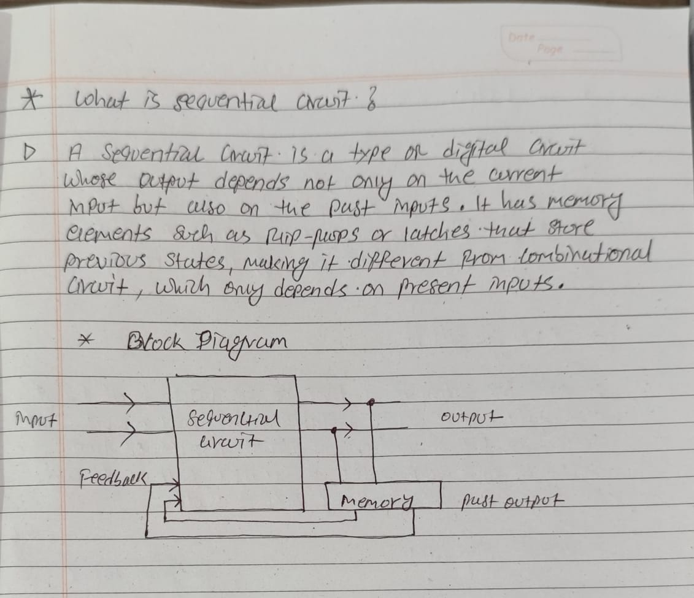
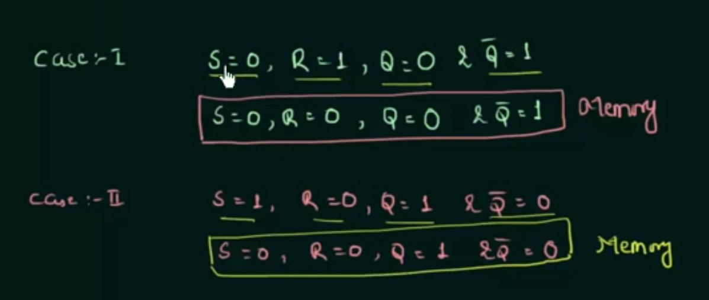
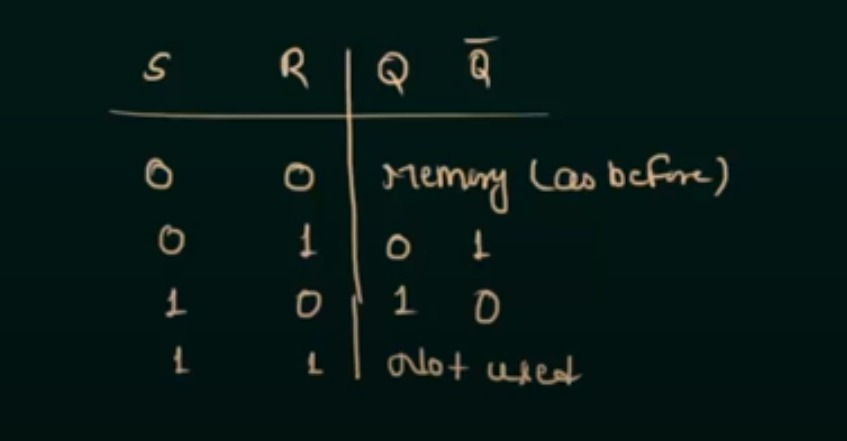
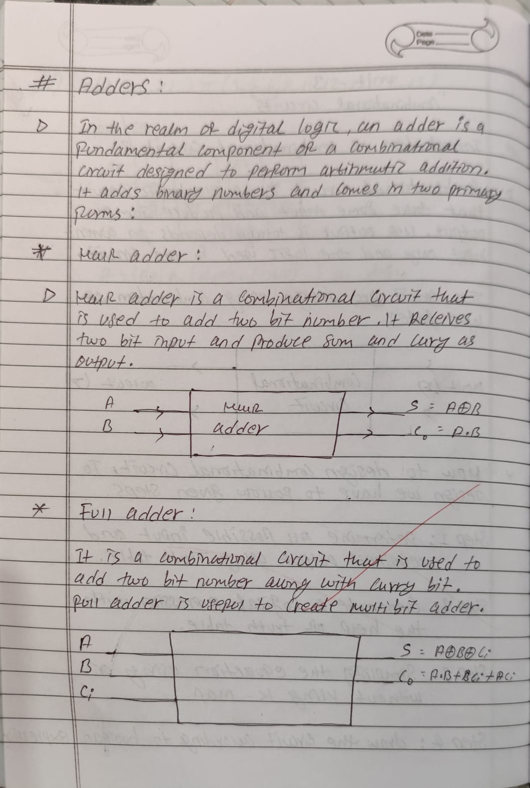

## Sequential circuit

## SR Latch

## Cases

## Sr Latch using NAND GATE

# Question : 
## what is clock?

## Difference between Latch and flip flop

## Introduction to SR flip flop

  

# D - FLIP FLOP

  

# JK - Flip flop

  

## Design 3-bit odd parity generator

## Design 3-bit even parity generator

## What is n bit parallel adder

## 4-bit parellal adder

## Design of master slave flip flop by using JK flip flop along with its circuit diagram and truth table

## Discuss the race condition in JK flip flop and methods to overcome it

## Write down the difference between synchronous and a synchronous counter

## Explain the ring counter with circuit state and timing diagram

## What is adder

## What is subtractor

## PROM, PAL, and PLA

