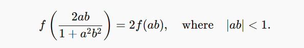
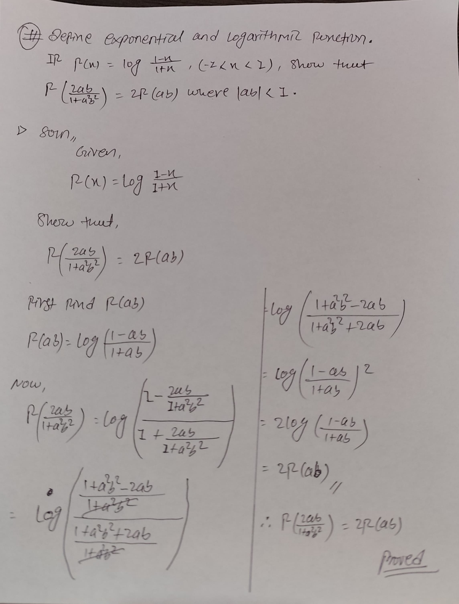
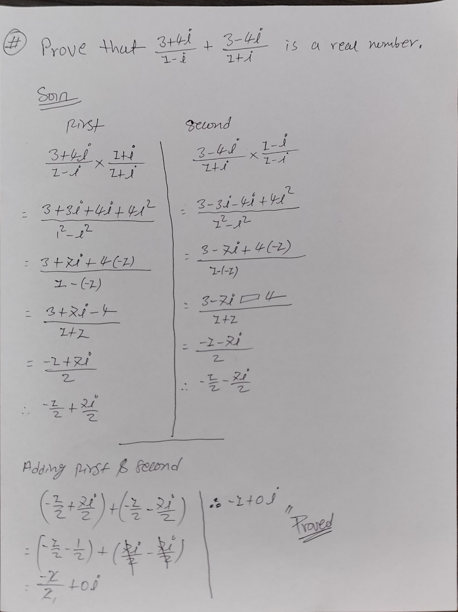
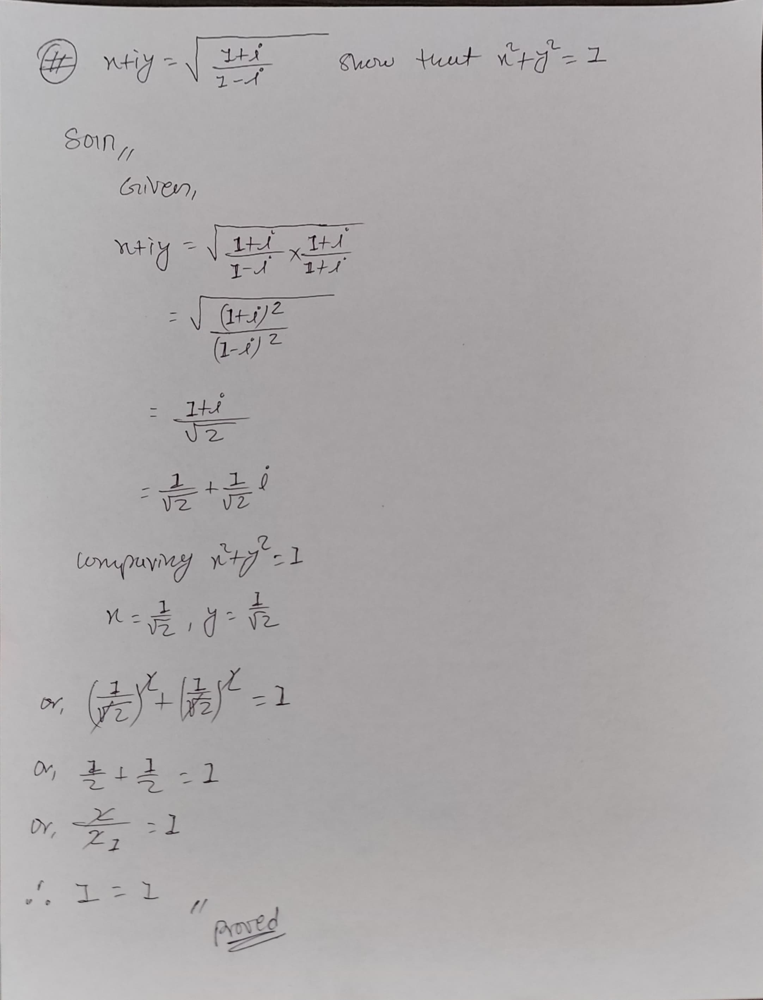
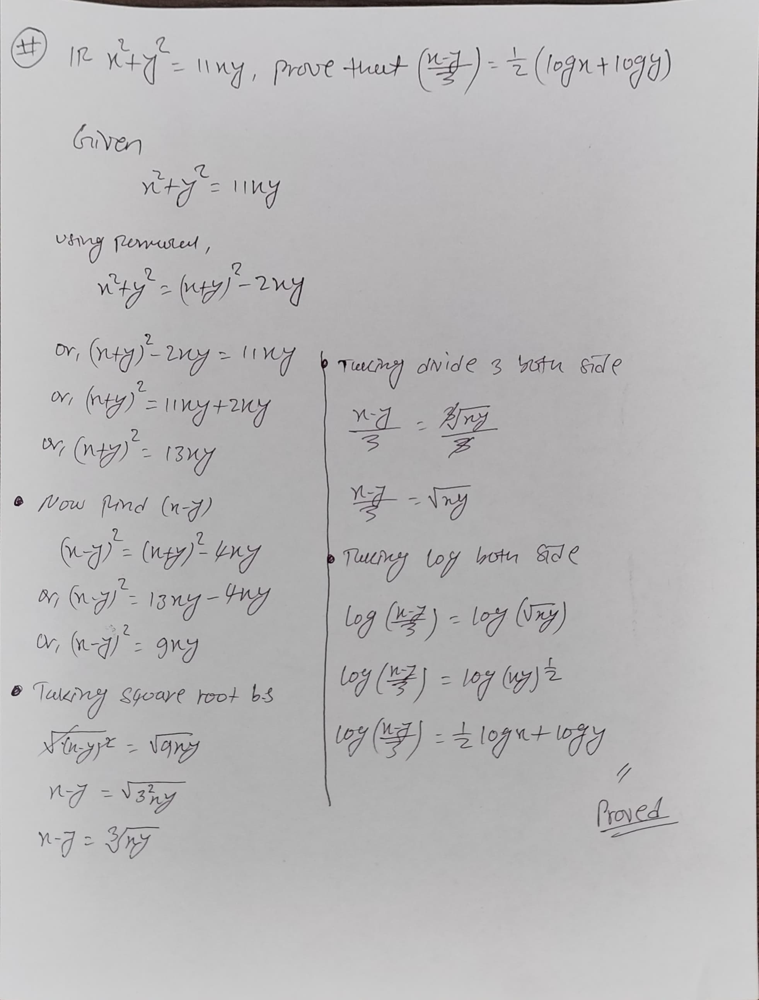

# Math Questions

## 1. Define Exponential and Logarithmic Function

**Question and solution Image:**

---

## 2. Complex Number Proof

**Question and solution Image:**

 

---

## 3. Modulus of Complex Expression

**Question and solution Image:**

---

## 4. Logarithmic Proof

**Question and solution Image:**
