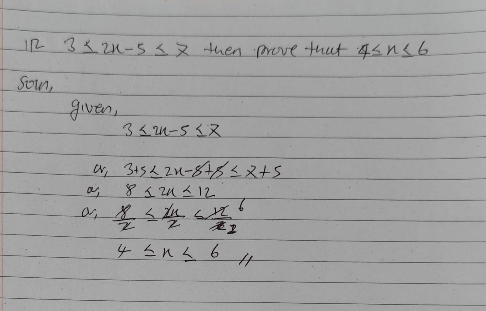

## 1. Prove root 5 is a rational number.
;

 

# Unit: Relation, Fnctions and Graphs

## 2. Find X and y if(x-y, 2x + y) = (5,3).

## 3. If A = {1,3} and B = {-2,1}, find AXB and BXA.

## 4. If A={3,5} and B={y:y=x+1,x€A}, find AXB.

## 5. if A = {a,b,c}, B = {a,c} and C = {c,d}, find AX(BUC) and AX(B intersection C).

## 6. Let A = {1,2,3}. Find the relation in AXA satisfying the condition X>Y for all (x,y) € AXA. find the domain and range of the relation.

  

## 7. Matrix: Prove that

## 8. if 3<= 2x-5 <= 7 then prove that 4<=x <= 6

# Unit: Sequence and Series : mean : Theorems
## Theorem: 1

## Theorem: 2

## Theorem: 3

## Theorem: 4

